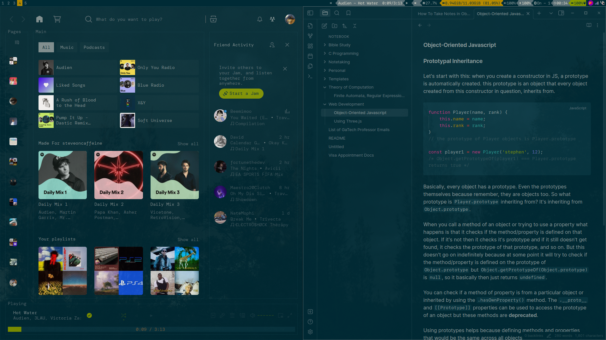
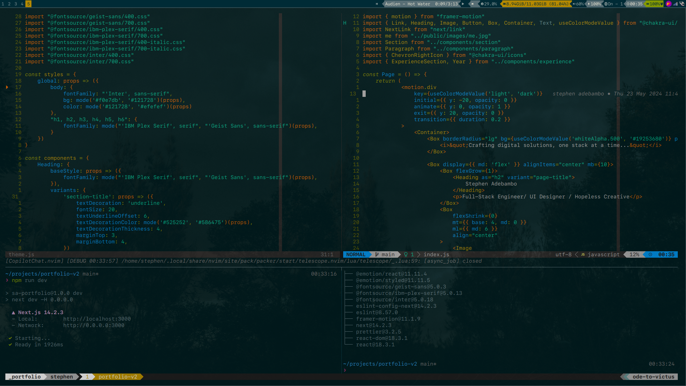
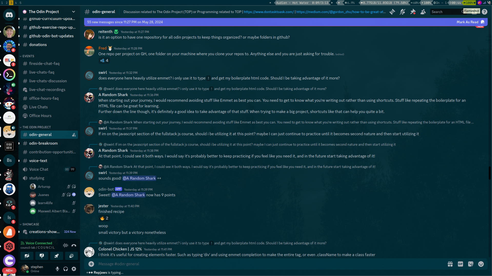
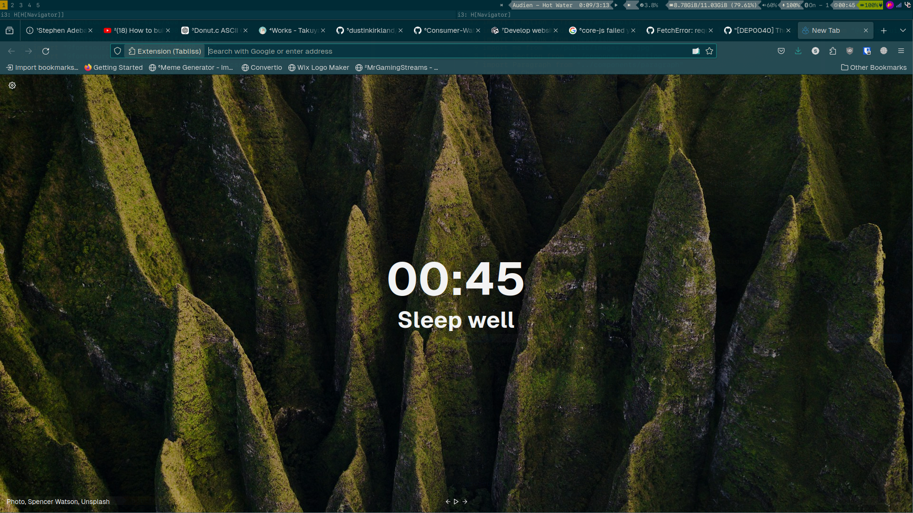
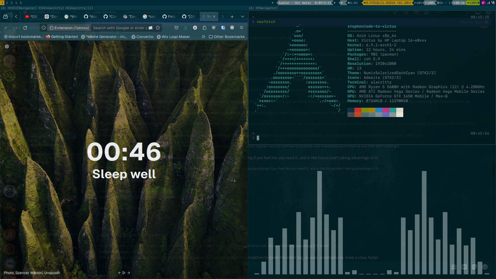

# My Dotfiles

This repository contains my personal configuration for my i3wm setup.

# Screenshots

## Theming

I installed i3wm alongside gnome on arch-linux. I made use of some gnome tools
to theme apps on i3. I'm using the NumixSolarizedDarkCyan GTK theme. On Neovim,
I'm using [crafzdog's](https://github.com/craftzdog) solarized-osaka.nvim and
custom solarized colors on i3. These are just the main theme config.
The configs are available on the repo in their respective folders.

## Tools and Packages

- i3wm
    - bumblebee status
    - picom
    - lxappearance

- pcmanfm (file explorer)

- tmux
    - tpm

- neovim
    - packer

- spotify
    - spicetify(theme: text, colorscheme: solarized)

- volnoti (volume notifications)
- flameshot (screenshot utility)
- Fonts: Geist(main), SFMono Nerd Font Mono(monospace and terminal)
